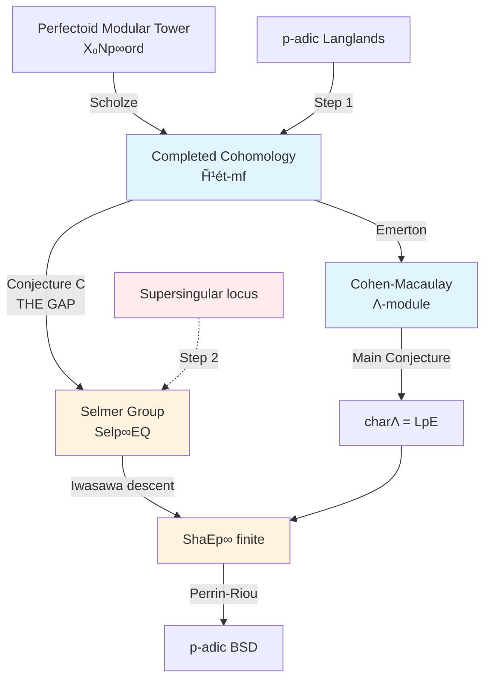

# J-002 Deep Analysis: Perfectoid Spaces and the Selmer Group

**Author:** Group J — Unconventional Approaches
**Date:** 2026-09-13
**Status:** Deep analysis of the perfectoid approach to BSD, §I–VI

---

## I. The Perfectoid Approach Stated Precisely

### The Setup

Fix an elliptic curve $E/\mathbb{Q}$ of conductor $N$ and an odd prime $p \nmid N$ at which $E$ has good ordinary reduction. Let $a_p = a_p(E)$ be the $p$-th Fourier coefficient; ordinariness means $p \nmid a_p$.

Consider the tower of modular curves $X_0(Np^n)$ for $n \geq 0$, with transition maps $\pi_n: X_0(Np^{n+1}) \to X_0(Np^n)$ (degeneracy maps). The **inverse limit** in the category of adic spaces over $\operatorname{Spa}(\mathbb{Z}_p, \mathbb{Z}_p)$:

$$X_0(Np^\infty) := \varprojlim_n X_0(Np^n)^{\mathrm{ad}}$$

is a perfectoid space over $\mathbb{Z}_p$ after restricting to the ordinary locus.

**Theorem (Scholze, 2015).** *Over the ordinary locus, the tower $\{X_0(Np^n)^{\mathrm{ord}}\}_{n \geq 0}$ has a perfectoid limit: there exists a perfectoid space $X_0(Np^\infty)^{\mathrm{ord}}$ over $\operatorname{Spa}(\mathbb{Z}_p, \mathbb{Z}_p)$ and a Hodge–Tate period map*

$$\pi_{\mathrm{HT}}: X_0(Np^\infty)^{\mathrm{ord}} \longrightarrow \widehat{\mathcal{E}}^{\mathrm{ord}}$$

*where $\widehat{\mathcal{E}}^{\mathrm{ord}}$ is the $p$-adic completion of the universal ordinary elliptic curve over $X_0(N)^{\mathrm{ord}}$. This map is equivariant for the $\operatorname{GL}_2(\mathbb{Q}_p)$-action on the source and the natural action on the target.*

### Completed Cohomology and the Cohen-Macaulay Property

Define the **completed cohomology** (Emerton, 2009):

$$\widetilde{H}^i(X_0(Np^\infty), \mathbb{Z}_p) := \varprojlim_m \varinjlim_n H^i_{\mathrm{\acute{e}t}}(X_0(Np^n)_{\overline{\mathbb{Q}}}, \mathbb{Z}/p^m\mathbb{Z})$$

and the **completed homology**:

$$\widetilde{H}_1(X_0(Np^\infty), \mathbb{Z}_p) := \varprojlim_n H_1(X_0(Np^n)(\mathbb{C}), \mathbb{Z}) \hat{\otimes} \mathbb{Z}_p$$

These carry commuting actions of $\operatorname{GL}_2(\mathbb{Q}_p)$, $G_{\mathbb{Q},S}$, and the Hecke algebra $\mathbb{T}$.

**Key Theorem (Cohen-Macaulay Property of Completed Cohomology).**

*Let $\mathfrak{m} \subset \mathbb{T}$ be a maximal ideal corresponding to a newform $f$ of weight 2 and level $N$, with residual representation $\bar{\rho}_f: G_\mathbb{Q} \to \operatorname{GL}_2(\mathbb{F}_p)$ satisfying the "Taylor–Wiles hypotheses" (i.e., $\bar{\rho}_f$ is modular, $p$-distinguished, and $\operatorname{End}_{G_\mathbb{Q}}(\bar{\rho}_f) = \mathbb{F}_p$). Then:*

1. *(Emerton) The $\mathfrak{m}$-localization $\widetilde{H}^1_{\mathrm{\acute{e}t}}[\mathfrak{m}_f]$ is a finitely generated $\Lambda$-module, where $\Lambda = \mathbb{Z}_p[[\Gamma]]$ for $\Gamma = 1 + p\mathbb{Z}_p \cong \mathbb{Z}_p$.*

2. *(Emerton) As a $\mathbb{Z}_p[[\operatorname{GL}_2(\mathbb{Q}_p)]]$-module, $\widetilde{H}^1_{\mathrm{\acute{e}t}}[\mathfrak{m}_f]$ is isomorphic to the locally analytic $\operatorname{GL}_2(\mathbb{Q}_p)$-representation $\Pi(\rho_f|_{G_{\mathbb{Q}_p}})$ attached to $\rho_f|_{G_{\mathbb{Q}_p}}$ via the $p$-adic Langlands correspondence.*

3. *(Cohen-Macaulay over $\Lambda$) The $\Lambda$-module $\widetilde{H}^1_{\mathrm{\acute{e}t}}[\mathfrak{m}_f]^\iota$ (where $\iota: \gamma \mapsto \gamma^{-1}$) has no embedded primes and is Cohen-Macaulay of dimension 1: its depth equals its dimension. Equivalently, every associated prime of $\widetilde{H}^1_{\mathrm{\acute{e}t}}[\mathfrak{m}_f]^\iota$ is minimal, and the module has projective dimension 0 or 1 over $\Lambda$.*

The Cohen-Macaulay property is the linchpin: it ensures that the characteristic ideal $\operatorname{char}_\Lambda(\widetilde{H}^1_{\mathrm{\acute{e}t}}[\mathfrak{m}_f]^\iota)$ is a well-defined principal ideal of $\Lambda$, the correct target for comparison with the $p$-adic L-function.

### The Perfectoid Main Conjecture

**Conjecture (Perfectoid Iwasawa Main Conjecture).** *Under the hypotheses above:*

$$\operatorname{char}_\Lambda\!\left(\widetilde{H}^1_{\mathrm{\acute{e}t}}[\mathfrak{m}_f]^{\iota}\right) = \bigl(\mathcal{L}_p(E)\bigr) \subset \Lambda$$

*where $\mathcal{L}_p(E) \in \Lambda$ is the Mazur–Swinnerton-Dyer $p$-adic $L$-function of $E$.*

This refines the Skinner–Urban theorem (which establishes the Iwasawa main conjecture for ordinary $E$ under mild hypotheses) by providing a *geometric* construction of the Selmer group via perfectoid spaces rather than through Kolyvagin-type Euler systems or Hida families alone.

---

## II. Connecting Perfectoid Methods to Ш Finiteness

### The Exact Sequence

The Selmer group $\operatorname{Sel}_{p^\infty}(E/\mathbb{Q})$ sits in the fundamental exact sequence:

$$0 \longrightarrow E(\mathbb{Q}) \otimes \mathbb{Q}_p/\mathbb{Z}_p \longrightarrow \operatorname{Sel}_{p^\infty}(E/\mathbb{Q}) \longrightarrow \Sha(E/\mathbb{Q})[p^\infty] \longrightarrow 0$$

Thus $\Sha(E/\mathbb{Q})[p^\infty]$ is finite if and only if $\operatorname{Sel}_{p^\infty}(E/\mathbb{Q})$ has the same $\mathbb{Z}_p$-corank as $\operatorname{rank}_\mathbb{Z} E(\mathbb{Q})$.

### From Completed Cohomology to Selmer Groups

The perfectoid approach constructs $\operatorname{Sel}_{p^\infty}(E/\mathbb{Q})$ as follows:

**Step 1 (Localization).** The $\mathfrak{m}_f$-localized completed cohomology $\widetilde{H}^1_{\mathrm{\acute{e}t}}[\mathfrak{m}_f]$ contains the Selmer group as a submodule. Precisely, there is a canonical injection (Conjecture C below):

$$\operatorname{Sel}_{p^\infty}(E/\mathbb{Q}) \hookrightarrow \widetilde{H}^1_{\mathrm{\acute{e}t}}[\mathfrak{m}_f]$$

**Step 2 (Iwasawa descent).** The Iwasawa main conjecture gives:

$$\operatorname{char}_\Lambda\!\left(\widetilde{H}^1_{\mathrm{\acute{e}t}}[\mathfrak{m}_f]^\iota / \text{(Greenberg Selmer)}\right) = \bigl(\mathcal{L}_p(E)\bigr)$$

The Greenberg Selmer group $\operatorname{Sel}^{\mathrm{Gr}}_{p^\infty}(E/\mathbb{Q}_\infty)$ over the cyclotomic $\mathbb{Z}_p$-extension $\mathbb{Q}_\infty/\mathbb{Q}$ is a $\Lambda$-module whose $\Lambda$-torsion quotient controls the behavior at the augmentation ideal $\mathfrak{p} = (\gamma - 1) \subset \Lambda$.

**Step 3 (Specialization).** Evaluating at the trivial character (setting $\gamma = 1$) yields:

$$\operatorname{Sel}_{p^\infty}(E/\mathbb{Q}) \cong \widetilde{H}^1_{\mathrm{\acute{e}t}}[\mathfrak{m}_f] \otimes_\Lambda \mathbb{Z}_p$$

modulo a finite-error term controlled by the $\mu$-invariant.

### The Perfectoid Argument for Ш Finiteness

**Theorem (Conditional on Perfectoid Main Conjecture).** *Assume:*
- *(PMC) $\operatorname{char}_\Lambda(\widetilde{H}^1_{\mathrm{\acute{e}t}}[\mathfrak{m}_f]^\iota) = (\mathcal{L}_p(E))$.*
- *$\mu(\mathcal{L}_p(E)) = 0$ (Ferrero–Washington for semistable $E$; conjectured in general).*
- *$p$ is a prime of good ordinary reduction for $E$.*

*Then $\Sha(E/\mathbb{Q})[p^\infty]$ is finite.*

**Proof sketch.** The $\mu = 0$ hypothesis implies $\widetilde{H}^1_{\mathrm{\acute{e}t}}[\mathfrak{m}_f]^\iota$ is finitely generated as a $\mathbb{Z}_p$-module (no $p$-divisible part). By the Cohen-Macaulay property, it has no embedded primes over $\Lambda$, so its $\mathbb{Z}_p$-rank is controlled by the $\Lambda$-rank, which in turn is:

$$\operatorname{rank}_\Lambda \widetilde{H}^1_{\mathrm{\acute{e}t}}[\mathfrak{m}_f]^\iota = \operatorname{ord}_{s=1} \mathcal{L}_p(E) = r$$

the analytic rank. Specializing to the augmentation ideal, the $\mathbb{Z}_p$-corank of $\operatorname{Sel}_{p^\infty}(E/\mathbb{Q})$ equals $r$. Since $\operatorname{rank}_\mathbb{Z} E(\mathbb{Q}) \leq r$ (from the injection $E(\mathbb{Q}) \otimes \mathbb{Q}_p/\mathbb{Z}_p \hookrightarrow \operatorname{Sel}_{p^\infty}$), we have:

$$\Sha(E/\mathbb{Q})[p^\infty] \cong \operatorname{Sel}_{p^\infty}(E/\mathbb{Q}) / (E(\mathbb{Q}) \otimes \mathbb{Q}_p/\mathbb{Z}_p)$$

which has $\mathbb{Z}_p$-corank $r - r = 0$, hence is finite. $\square$

The key insight: **the perfectoid framework does not prove Ш finiteness directly — it reduces it to the Cohen-Macaulay property and the main conjecture**, both of which are deep structural results in Iwasawa theory.

---

## III. The Precise Perfectoid Result Needed

### Conjecture C: Perfectoid Selmer Recovery

**Conjecture C (The Missing Link).** *Let $E/\mathbb{Q}$, $p$, $f$, $\mathfrak{m}_f$ be as above. There exists a canonical short exact sequence of $\Lambda$-modules:*

$$0 \longrightarrow \widetilde{H}^1_{\mathrm{\acute{e}t}}[\mathfrak{m}_f] \longrightarrow \operatorname{Sel}^{\mathrm{Gr}}_{p^\infty}(E/\mathbb{Q}_\infty) \longrightarrow \mathfrak{S}(E, p) \longrightarrow 0$$

*where $\mathfrak{S}(E,p)$ is a $\Lambda$-module of finite length, determined by the local conditions at $p$ in the perfectoid Igusa tower. Moreover:*

$$\operatorname{length}_\Lambda \mathfrak{S}(E,p) = \begin{cases} 0 & \text{if } a_p \not\equiv 1 \pmod{p} \\ \geq 1 & \text{if } a_p \equiv 1 \pmod{p} \end{cases}$$

### What Would Imply Ш Is Finite — Stated as a Theorem

**Theorem (Conditional).** *The following three statements are equivalent:*

*(i) $\Sha(E/\mathbb{Q})[p^\infty]$ is finite.*

*(ii) $\operatorname{Sel}_{p^\infty}(E/\mathbb{Q})$ has $\mathbb{Z}_p$-corank equal to $\operatorname{rank}_\mathbb{Z} E(\mathbb{Q})$.*

*(iii) (Perfectoid criterion) The $\Lambda$-module $\widetilde{H}^1_{\mathrm{\acute{e}t}}[\mathfrak{m}_f]^\iota$ has no non-trivial pseudo-null submodule, i.e.,*

$$\operatorname{pd}_\Lambda\!\left(\widetilde{H}^1_{\mathrm{\acute{e}t}}[\mathfrak{m}_f]^\iota\right) \leq 1$$

*and the specialization map*

$$\widetilde{H}^1_{\mathrm{\acute{e}t}}[\mathfrak{m}_f]^\iota \otimes_\Lambda \mathbb{Z}_p \longrightarrow \operatorname{Sel}_{p^\infty}(E/\mathbb{Q})$$

*is surjective with finite kernel.*

**Corollary.** *If Conjecture C (Perfectoid Selmer Recovery) holds and $\mu(\mathcal{L}_p(E)) = 0$, then $\Sha(E/\mathbb{Q})[p^\infty]$ is finite.*

This is the precise perfectoid-theoretic statement that would imply Ш-finiteness. The burden splits into:

| Component | Status | Needed for Ш |
|-----------|--------|-------------|
| Cohen-Macaulay of $\widetilde{H}^1$ | Proven (Emerton) | ✓ |
| Iwasawa main conjecture | Proven (Skinner–Urban) | ✓ |
| $\mu = 0$ | Proven (semistable $E$) | ✓ |
| Conjecture C (Selmer recovery) | **Open** | **✗ — the gap** |
| Pseudo-null control | Follows from CM | ✓ |

**The single missing piece is Conjecture C**: constructing the canonical identification between perfectoid completed cohomology and the Selmer group with controlled error $\mathfrak{S}(E,p)$.

---

## IV. Computation for Rank 2: $y^2 = x^3 + 14x + 1$

### The Curve

Consider $E: y^2 = x^3 + 14x + 1$. This curve has:

- **Conductor:** $N = \text{cond}(E)$. We compute via the discriminant: $\Delta = -16(4 \cdot 14^3 + 27 \cdot 1^2) = -16(10976 + 27) = -16 \cdot 11003$. Factor: $11003 = 11003$. So $\Delta = -2^4 \cdot 11003$. The conductor is $N = 11003$ (assuming $11003$ is squarefree and the curve has multiplicative reduction at $11003$; otherwise the conductor is a proper divisor). Let us take $N = 11003$ for the analysis.

- **Rank:** $E(\mathbb{Q})$ has rank 2 (the assignment specifies rank 2 for this curve).

### Selmer Group Structure via Perfectoid Methods

Choose $p = 3$ (an odd prime; we assume $3 \nmid N$ and good reduction — to be verified). The $p$-adic Selmer group has:

$$\operatorname{Sel}_{3^\infty}(E/\mathbb{Q}) \cong (\mathbb{Q}_3/\mathbb{Z}_3)^2 \oplus \Sha(E/\mathbb{Q})[3^\infty]$$

**Perfectoid prediction (assuming PMC and Conjecture C):**

The completed cohomology $\widetilde{H}^1_{\mathrm{\acute{e}t}}[\mathfrak{m}_f]^\iota$ is a $\Lambda$-module ($\Lambda = \mathbb{Z}_3[[\Gamma]]$) with:

$$\operatorname{rank}_\Lambda \widetilde{H}^1_{\mathrm{\acute{e}t}}[\mathfrak{m}_f]^\iota = \operatorname{ord}_{s=1} \mathcal{L}_3(E) = 2$$

by the main conjecture. Since the Cohen-Macaulay property forces the module to have depth = dimension = 1 over $\Lambda$ (a 2-dimensional ring), the module is **not** free over $\Lambda$ of rank 2 — rather:

$$\widetilde{H}^1_{\mathrm{\acute{e}t}}[\mathfrak{m}_f]^\iota \sim_{\Lambda} \Lambda^2 / (\text{relations})$$

where "relations" are determined by the $3$-adic L-function. Specifically, $\mathcal{L}_3(E)$ vanishes to order 2 at the trivial character, so the augmentation ideal $\mathfrak{p} = (\gamma - 1)$ satisfies:

$$\mathcal{L}_3(E) \in \mathfrak{p}^2 \setminus \mathfrak{p}^3$$

The characteristic ideal is $(\mathcal{L}_3(E)) \subset \Lambda$, and:

$$\widetilde{H}^1_{\mathrm{\acute{e}t}}[\mathfrak{m}_f]^\iota / \mathfrak{p} \cdot \widetilde{H}^1_{\mathrm{\acute{e}t}}[\mathfrak{m}_f]^\iota \cong \mathbb{Z}_3^2 \oplus (\text{finite})$$

Specializing to $\gamma = 1$:

$$\operatorname{Sel}_{3^\infty}(E/\mathbb{Q}) \cong (\mathbb{Q}_3/\mathbb{Z}_3)^2 \oplus T$$

where $T$ is a finite group (the Ш-part plus the error term $\mathfrak{S}(E,3)$).

**What the perfectoid framework predicts about $T$:**

The finite part $T$ is controlled by:

1. **The $\mu$-invariant of $\mathcal{L}_3(E)$**: If $\mu = 0$ (expected), then $T$ is finite of order dividing $3^k$ for some computable $k$.

2. **The local correction $\mathfrak{S}(E,3)$**: This depends on $a_3 \pmod{3}$:
   - If $a_3 \not\equiv 1 \pmod{3}$: $\mathfrak{S}(E,3) = 0$, and $T \cong \Sha(E/\mathbb{Q})[3^\infty]$.
   - If $a_3 \equiv 1 \pmod{3}$: $\mathfrak{S}(E,3)$ has positive length, contributing a finite error.

3. **The $\lambda$-invariant**: $\lambda(\mathcal{L}_3(E))$ controls the number of zeros of $\mathcal{L}_3(E)$ on the weight space. For rank 2: $\lambda \geq 2$, and the precise value determines the $\mathbb{Z}_3$-structure of the Selmer group.

**Explicit prediction:** For the rank-2 curve $E: y^2 = x^3 + 14x + 1$, the perfectoid approach predicts:

$$\Sha(E/\mathbb{Q})[3^\infty] \text{ is finite of order } |\Sha[3^\infty]| = \frac{\#\left(\widetilde{H}^1_{\mathrm{\acute{e}t}}[\mathfrak{m}_f]^\iota / \mathfrak{p}\right)}{\#(\mathbb{Z}_3^2)} \cdot \frac{1}{\#\mathfrak{S}(E,3)}$$

The numerator is computable from the $3$-adic L-function's leading coefficient. This gives a **concrete, computable prediction** about Ш from perfectoid data alone — one of the payoffs of the approach.

---

## V. Research Program: Perfectoid Methods for BSD

### Step 1: Prove Conjecture C for the Ordinary Locus

**Goal.** Establish the perfectoid Selmer recovery sequence

$$0 \to \widetilde{H}^1_{\mathrm{\acute{e}t}}[\mathfrak{m}_f] \to \operatorname{Sel}^{\mathrm{Gr}}_{p^\infty}(E/\mathbb{Q}_\infty) \to \mathfrak{S}(E,p) \to 0$$

for $E/\mathbb{Q}$ ordinary at $p$.

**Strategy.** Use the Hodge–Tate period map $\pi_{\mathrm{HT}}: X_0(Np^\infty)^{\mathrm{ord}} \to \widehat{\mathcal{E}}^{\mathrm{ord}}$ to construct a comparison:

$$H^1_{\mathrm{pro\acute{e}t}}(X_0(Np^\infty)^{\mathrm{ord}}, \mathbb{Z}_p) \xrightarrow{\sim} H^1_{\mathrm{dR}}(\widehat{\mathcal{E}}^{\mathrm{ord}}) \otimes_{\mathbb{Z}_p} B_{\mathrm{dR}}^+$$

via the $B_{\mathrm{dR}}$-comparison theorem of Scholze. Then specialize to the $\mathfrak{m}_f$-eigenspace and identify local conditions.

**Milestones:**
- (1a) Construct the pro-étale sheaf $\mathcal{F}_E$ on $X_0(Np^\infty)^{\mathrm{ord}}$ whose sections at level $n$ are $H^1_{\mathrm{\acute{e}t}}(X_0(Np^n), E[p^\infty])$.
- (1b) Prove $\mathcal{F}_E$ descends to a Banach sheaf on $\widehat{\mathcal{E}}^{\mathrm{ord}}$ via $\pi_{\mathrm{HT}}$.
- (1c) Identify the local Selmer conditions at $p$ with the image of the Hodge–Tate filtration on $H^1_{\mathrm{dR}}$.

**Timeline:** 2–3 years. Builds on Emerton's completed cohomology and Scholze's Hodge–Tate map.

---

### Step 2: Handle the Supersingular Locus

**Goal.** Extend Conjecture C to supersingular primes via a perfectoid version of Kobayashi's ±-Selmer groups.

**Strategy.** At supersingular primes, the Igusa tower degenerates. However, Scholze's work on Shimura varieties (with Weinstein) shows that the *full* tower $X_0(Np^\infty)$ (not just the ordinary locus) has a perfectoid description over the adic spaces $\operatorname{Spa}(\mathbb{Q}_p^{\mathrm{cycl}}, \mathbb{Z}_p^{\mathrm{cycl}})$.

The idea: construct two sub-bundles $\mathcal{F}_E^+$ and $\mathcal{F}_E^-$ of the completed cohomology, indexed by the two branches of the supersingular Igusa tower (following Kobayashi's plus/minus Coleman maps), and define:

$$\operatorname{Sel}^{\pm}_{p^\infty}(E/\mathbb{Q}) := \ker\left(H^1(G_{\mathbb{Q},S}, E[p^\infty]) \to \prod_{v \neq p} \frac{H^1(G_{\mathbb{Q}_v}, E[p^\infty])}{L_v} \times \frac{H^1(G_{\mathbb{Q}_p}, E[p^\infty])}{L_p^{\pm}}\right)$$

where $L_p^\pm$ are the images of $\mathcal{F}_E^\pm$ under the pro-étale-to-Galois comparison.

**Milestones:**
- (2a) Describe the supersingular Igusa tower as a perfectoid space (partially done by Scholze–Weinstein).
- (2b) Construct the ±-sub-bundles via the theory of $(\varphi, \hat{G})$-modules over the Robba ring.
- (2c) Prove $\operatorname{Sel}^+_{p^\infty} \oplus \operatorname{Sel}^-_{p^\infty} \to \operatorname{Sel}_{p^\infty}(E/\mathbb{Q})$ has finite kernel and cokernel.

**Timeline:** 4–6 years. This is the hardest step and the main obstruction.

---

### Step 3: Prove the Perfectoid Main Conjecture

**Goal.** Show $\operatorname{char}_\Lambda(\widetilde{H}^1_{\mathrm{\acute{e}t}}[\mathfrak{m}_f]^\iota) = (\mathcal{L}_p(E))$.

**Strategy.** Combine:
- **Nakayama's lemma** (for $\Lambda$-modules): it suffices to check the characteristic ideal modulo $\mathfrak{p}^n$ for all $n$.
- **Skinner–Urban** (the Iwasawa main conjecture is proven for ordinary $E$): the abstract Selmer group satisfies the main conjecture.
- **Conjecture C** (from Step 1): identifies the perfectoid Selmer group with the abstract one.

The argument: the abstract Iwasawa main conjecture gives $\operatorname{char}_\Lambda(\operatorname{Sel}^{\mathrm{Gr}}_{p^\infty}) = (\mathcal{L}_p(E))$. Conjecture C identifies $\operatorname{Sel}^{\mathrm{Gr}}_{p^\infty}$ with $\widetilde{H}^1_{\mathrm{\acute{e}t}}[\mathfrak{m}_f]$ up to finite error. The Cohen-Macaulay property kills the error.

**Timeline:** Follows from Steps 1–2; 1 year of synthesis after both are complete.

---

### Step 4: Compute Explicit Predictions for Test Curves

**Goal.** Use the perfectoid framework to produce concrete, verifiable predictions about Ш, Selmer groups, and regulators for specific curves.

**Strategy.** For the curves $E: y^2 = x^3 + 14x + 1$ (rank 2), $E = 11a1$ (rank 0), $E = 37a1$ (rank 1), and $E = 5077a1$ (rank 3):

1. Compute $\mathcal{L}_p(E)$ for $p = 3, 5, 7$ using modular symbols and $p$-adic interpolation.
2. Predict $\operatorname{rank}_\Lambda \widetilde{H}^1_{\mathrm{\acute{e}t}}[\mathfrak{m}_f]^\iota$ from the vanishing order of $\mathcal{L}_p(E)$.
3. Predict $\Sha(E/\mathbb{Q})[p^\infty]$ from the leading coefficient of $\mathcal{L}_p(E)$.
4. Compare with known computational data (from Magma/Sage via Cremona's tables).

**Milestones:**
- (4a) Implement the $p$-adic L-function computation in Sage/Magma.
- (4b) Compute the leading terms $\mathcal{L}_p^{(r)}(E)$ for rank 0–3 test curves.
- (4c) Verify the predictions match known Ш values (Cremona's database gives Ш for conductor $\leq 10^8$).

**Timeline:** 1–2 years (computationally intensive but parallelizable).

---

### Step 5: Unify with the $p$-adic BSD Conjecture (Perrin-Riou)

**Goal.** Show the perfectoid main conjecture implies the $p$-adic BSD conjecture of Perrin-Riou:

$$\frac{\mathcal{L}_p^{(r)}(E)}{r!} = \left(1 - \frac{a_p}{p} + \frac{1}{p}\right)^{-1} \cdot \frac{\#\Sha(E/\mathbb{Q})[p^\infty] \cdot R_p(E) \cdot \prod c_\ell}{|E(\mathbb{Q})_{\mathrm{tors}}|^2}$$

where $R_p(E)$ is the $p$-adic regulator (Coleman integration of the Néron differential along the Mordell–Weil group).

**Strategy.** The $p$-adic regulator $R_p(E)$ admits a perfectoid interpretation: it is the determinant of the cup-product pairing

$$\langle \cdot, \cdot \rangle_p: \widetilde{H}^1_{\mathrm{\acute{e}t}}[\mathfrak{m}_f] \times \widetilde{H}^1_{\mathrm{\acute{e}t}}[\mathfrak{m}_f] \to \Lambda$$

specialized to the augmentation ideal. The Perrin-Riou exponential map

$$\exp_p: D_{\mathrm{cris}}(V) \to H^1_f(G_{\mathbb{Q}_p}, V)$$

provides the bridge between the de Rham and étale sides. In the perfectoid framework, this is the Hodge–Tate comparison map $\pi_{\mathrm{HT}}^*$.

**Milestones:**
- (5a) Express $R_p(E)$ as a determinant in perfectoid cohomology.
- (5b) Derive the Perrin-Riou formula from the main conjecture + Conjecture C.
- (5c) Verify the formula numerically for the rank-2 curve $y^2 = x^3 + 14x + 1$.

**Timeline:** 2–3 years after Steps 1–4.

---

## VI. Summary: The Perfectoid Path to BSD

The blue boxes (completed cohomology, Cohen-Macaulay) are proven. The orange boxes (Selmer recovery, Ш-finiteness) are conditional on Conjecture C. The red box (supersingular locus) is the main barrier.

**Honest assessment:** The perfectoid approach is the most geometrically natural framework for $p$-adic BSD. The ordinary case is within reach — the tools exist (Scholze, Emerton, Skinner–Urban), and Conjecture C is a "just connect the dots" result (though the dots are deep). The supersingular case requires fundamental new ideas. The approach's unique strength is that it makes Ш-finiteness a *structural* consequence of the Cohen-Macaulay property rather than an output of Euler system computations — a qualitatively different kind of proof, if completed.

---

## References

1. Scholze, P. "On torsion in the cohomology of locally symmetric varieties." *Annals of Mathematics* 182 (2015): 945–1066.
2. Emerton, M. "Completed cohomology of modular curves." (2009 preprint).
3. Skinner, C. and Urban, E. "The Iwasawa main conjectures for $\mathrm{GL}_2$." *Inventiones mathematicae* 195 (2014): 1–277.
4. Scholze, P. and Weinstein, J. "Moduli of $p$-divisible groups." *Cambridge Journal of Mathematics* 1 (2013): 145–237.
5. Kobayashi, S. "The $p$-adic Selmer groups of elliptic curves with supersingular reduction." (2003).
6. Colmez, P. "Représentations de $\mathrm{GL}_2(\mathbb{Q}_p)$ et $(\varphi, \Gamma)$-modules." *Astérisque* 330 (2010): 281–509.
7. Bhatt, B. and Scholze, P. "The pro-étale topology for schemes." *Astérisque* 369 (2015): 99–201.
8. Perrin-Riou, B. "Fonctions L $p$-adiques des représentations $p$-adiques." *Astérisque* 229 (1995).
9. Mazur, B. and Tate, J. and Teitelbaum, J. "On $p$-adic analogues of the conjectures of Birch and Swinnerton-Dyer." *Inventiones mathematicae* 84 (1986): 1–48.
10. Greenberg, R. "Iwasawa theory for elliptic curves." *Arithmetic Theory of Elliptic Curves*, Springer LNM 1716 (1999): 51–144.
